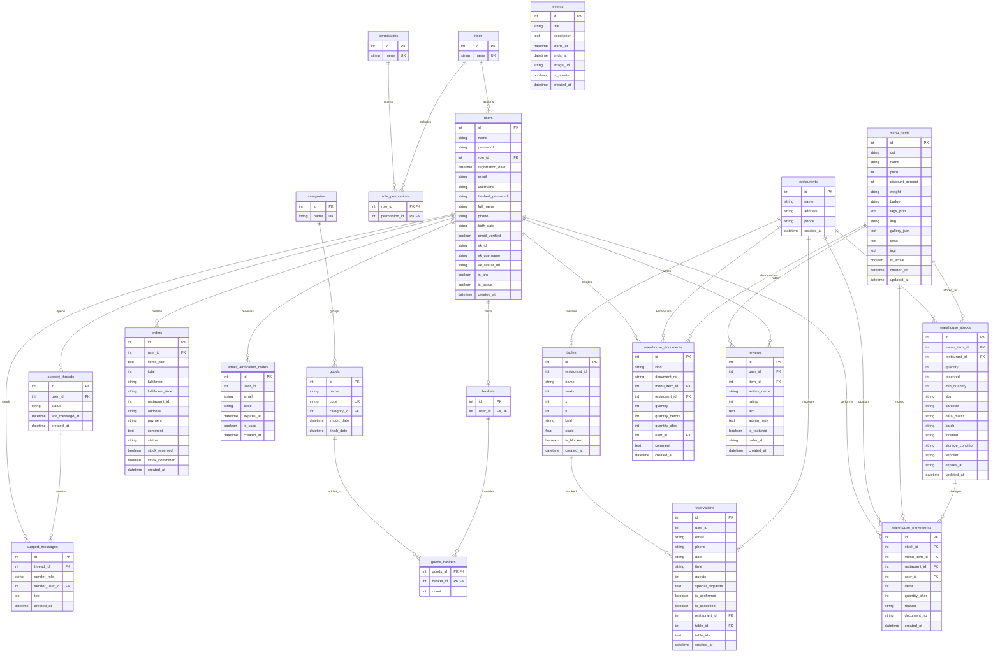

# Database ER Diagram

Note: `restaurants` and `tables` are legacy technical names in the database. In the current application they are used as store addresses/locations and old compatibility entities.
