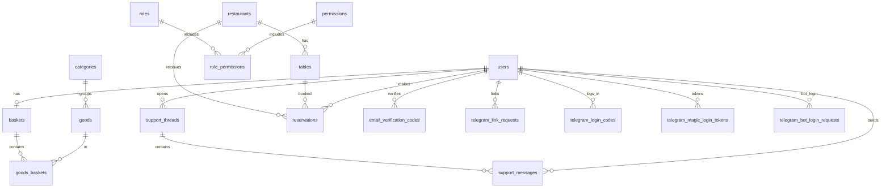

# Структура базы данных (SQLite)

- Файл БД: `backend/app.db`
- Движок: SQLite
- ORM: SQLAlchemy (модели в `backend/models.py`)
- Инициализация/создание таблиц: `backend/main.py` (`Base.metadata.create_all(bind=engine)`)

## ER-диаграмма (для отчёта)

Примечание: в текущем SQLite-файле часть связей хранится как **логические поля** без FK-constraint (например `users.role_id`, `reservations.restaurant_id/table_id`, `tables.restaurant_id`, `email_verification_codes.user_id`). На уровне приложения они используются как связи, даже если SQLite их не “заставляет” (из‑за legacy `ALTER TABLE`).

## Таблицы (фактическая схема из `backend/app.db`)

Формат: `NULL = YES` означает, что поле может быть `NULL`.

### `baskets`
| Поле | Тип | NULL | PK | DEFAULT |
|---|---|---:|---:|---|
| id | INTEGER | NO | 1 |  |
| user_id | INTEGER | NO |  |  |

- FK: `user_id → users.id`
- UNIQUE: `user_id`

### `categories`
| Поле | Тип | NULL | PK | DEFAULT |
|---|---|---:|---:|---|
| id | INTEGER | NO | 1 |  |
| name | VARCHAR | NO |  |  |

- UNIQUE: `name`

### `email_verification_codes`
| Поле | Тип | NULL | PK | DEFAULT |
|---|---|---:|---:|---|
| id | INTEGER | NO | 1 |  |
| user_id | INTEGER | NO |  |  |
| email | VARCHAR | NO |  |  |
| code | VARCHAR | NO |  |  |
| expires_at | DATETIME | NO |  |  |
| is_used | BOOLEAN | NO |  |  |
| created_at | DATETIME | YES |  | CURRENT_TIMESTAMP |

### `events`
| Поле | Тип | NULL | PK | DEFAULT |
|---|---|---:|---:|---|
| id | INTEGER | NO | 1 |  |
| title | VARCHAR | NO |  |  |
| description | TEXT | YES |  |  |
| starts_at | DATETIME | YES |  |  |
| ends_at | DATETIME | YES |  |  |
| image_url | VARCHAR | YES |  |  |
| is_private | BOOLEAN | NO |  |  |
| created_at | DATETIME | YES |  | CURRENT_TIMESTAMP |

### `goods`
| Поле | Тип | NULL | PK | DEFAULT |
|---|---|---:|---:|---|
| id | INTEGER | NO | 1 |  |
| name | VARCHAR | NO |  |  |
| code | VARCHAR | NO |  |  |
| category_id | INTEGER | NO |  |  |
| import_date | DATETIME | YES |  | CURRENT_TIMESTAMP |
| finish_date | DATETIME | YES |  |  |

- FK: `category_id → categories.id`
- UNIQUE: `code`

### `goods_baskets`
| Поле | Тип | NULL | PK | DEFAULT |
|---|---|---:|---:|---|
| goods_id | INTEGER | NO | 1 |  |
| basket_id | INTEGER | NO | 2 |  |
| count | INTEGER | NO |  |  |

- FK: `goods_id → goods.id`
- FK: `basket_id → baskets.id`

### `menu_items`
| Поле | Тип | NULL | PK | DEFAULT |
|---|---|---:|---:|---|
| id | INTEGER | NO | 1 |  |
| cat | VARCHAR | NO |  |  |
| name | VARCHAR | NO |  |  |
| price | INTEGER | NO |  |  |
| weight | VARCHAR | YES |  |  |
| badge | VARCHAR | YES |  |  |
| tags_json | TEXT | YES |  |  |
| img | VARCHAR | YES |  |  |
| desc | TEXT | YES |  |  |
| ingr | TEXT | YES |  |  |
| is_active | BOOLEAN | NO |  |  |
| created_at | DATETIME | YES |  | CURRENT_TIMESTAMP |
| updated_at | DATETIME | YES |  | CURRENT_TIMESTAMP |

### `permissions`
| Поле | Тип | NULL | PK | DEFAULT |
|---|---|---:|---:|---|
| id | INTEGER | NO | 1 |  |
| name | VARCHAR | NO |  |  |

- UNIQUE: `name`

### `reservations`
| Поле | Тип | NULL | PK | DEFAULT |
|---|---|---:|---:|---|
| id | INTEGER | NO | 1 |  |
| user_id | INTEGER | NO |  |  |
| email | VARCHAR | NO |  |  |
| phone | VARCHAR | NO |  |  |
| date | VARCHAR | NO |  |  |
| time | VARCHAR | NO |  |  |
| guests | INTEGER | NO |  |  |
| special_requests | TEXT | YES |  |  |
| is_confirmed | BOOLEAN | YES |  |  |
| created_at | DATETIME | YES |  | CURRENT_TIMESTAMP |
| restaurant_id | INTEGER | YES |  |  |
| table_id | INTEGER | YES |  |  |
| table_ids | TEXT | YES |  |  |
| is_cancelled | BOOLEAN | YES |  |  |

Логические связи (в моделях/коде): `user_id → users.id`, `restaurant_id → restaurants.id`, `table_id → tables.id`.

### `restaurants`
| Поле | Тип | NULL | PK | DEFAULT |
|---|---|---:|---:|---|
| id | INTEGER | NO | 1 |  |
| name | VARCHAR | NO |  |  |
| address | VARCHAR | NO |  |  |
| phone | VARCHAR | YES |  |  |
| created_at | DATETIME | YES |  | CURRENT_TIMESTAMP |

### `role_permissions`
| Поле | Тип | NULL | PK | DEFAULT |
|---|---|---:|---:|---|
| role_id | INTEGER | NO | 1 |  |
| permission_id | INTEGER | NO | 2 |  |

- FK: `role_id → roles.id`
- FK: `permission_id → permissions.id`

### `roles`
| Поле | Тип | NULL | PK | DEFAULT |
|---|---|---:|---:|---|
| id | INTEGER | NO | 1 |  |
| name | VARCHAR | NO |  |  |

- UNIQUE: `name`

### `support_messages`
| Поле | Тип | NULL | PK | DEFAULT |
|---|---|---:|---:|---|
| id | INTEGER | NO | 1 |  |
| thread_id | INTEGER | NO |  |  |
| sender_role | VARCHAR | NO |  |  |
| sender_user_id | INTEGER | YES |  |  |
| text | TEXT | NO |  |  |
| created_at | DATETIME | YES |  | CURRENT_TIMESTAMP |

- FK: `thread_id → support_threads.id`
- FK: `sender_user_id → users.id`

### `support_threads`
| Поле | Тип | NULL | PK | DEFAULT |
|---|---|---:|---:|---|
| id | INTEGER | NO | 1 |  |
| user_id | INTEGER | NO |  |  |
| status | VARCHAR | NO |  |  |
| last_message_at | DATETIME | YES |  | CURRENT_TIMESTAMP |
| created_at | DATETIME | YES |  | CURRENT_TIMESTAMP |

- FK: `user_id → users.id`

### `tables`
| Поле | Тип | NULL | PK | DEFAULT |
|---|---|---:|---:|---|
| id | INTEGER | NO | 1 |  |
| restaurant_id | INTEGER | NO |  |  |
| name | VARCHAR | NO |  |  |
| seats | INTEGER | NO |  |  |
| x | INTEGER | YES |  |  |
| y | INTEGER | YES |  |  |
| created_at | DATETIME | YES |  | CURRENT_TIMESTAMP |
| is_blocked | BOOLEAN | YES |  |  |

Логическая связь (в моделях/коде): `restaurant_id → restaurants.id`.

### `telegram_bot_contacts`
| Поле | Тип | NULL | PK | DEFAULT |
|---|---|---:|---:|---|
| id | INTEGER | NO | 1 |  |
| telegram_id | VARCHAR | NO |  |  |
| telegram_username | VARCHAR | YES |  |  |
| chat_id | VARCHAR | NO |  |  |
| phone | VARCHAR | YES |  |  |
| consent | BOOLEAN | YES |  |  |
| first_name | VARCHAR | YES |  |  |
| last_name | VARCHAR | YES |  |  |
| updated_at | DATETIME | YES |  | CURRENT_TIMESTAMP |
| created_at | DATETIME | YES |  | CURRENT_TIMESTAMP |

- UNIQUE: `telegram_id`

### `telegram_bot_login_requests`
| Поле | Тип | NULL | PK | DEFAULT |
|---|---|---:|---:|---|
| id | INTEGER | NO | 1 |  |
| code | VARCHAR | NO |  |  |
| telegram_id | VARCHAR | YES |  |  |
| user_id | INTEGER | YES |  |  |
| expires_at | DATETIME | NO |  |  |
| is_used | BOOLEAN | NO |  |  |
| created_at | DATETIME | YES |  | CURRENT_TIMESTAMP |

- UNIQUE: `code`

### `telegram_link_requests`
| Поле | Тип | NULL | PK | DEFAULT |
|---|---|---:|---:|---|
| id | INTEGER | NO | 1 |  |
| user_id | INTEGER | NO |  |  |
| code | VARCHAR | NO |  |  |
| requested_username | VARCHAR | YES |  |  |
| expires_at | DATETIME | NO |  |  |
| is_used | BOOLEAN | NO |  |  |
| created_at | DATETIME | YES |  | CURRENT_TIMESTAMP |

- UNIQUE: `code`

### `telegram_login_codes`
| Поле | Тип | NULL | PK | DEFAULT |
|---|---|---:|---:|---|
| id | INTEGER | NO | 1 |  |
| user_id | INTEGER | NO |  |  |
| telegram_id | VARCHAR | NO |  |  |
| code | VARCHAR | NO |  |  |
| expires_at | DATETIME | NO |  |  |
| is_used | BOOLEAN | NO |  |  |
| created_at | DATETIME | YES |  | CURRENT_TIMESTAMP |

### `telegram_magic_login_tokens`
| Поле | Тип | NULL | PK | DEFAULT |
|---|---|---:|---:|---|
| id | INTEGER | NO | 1 |  |
| user_id | INTEGER | NO |  |  |
| telegram_id | VARCHAR | NO |  |  |
| token | VARCHAR | NO |  |  |
| expires_at | DATETIME | NO |  |  |
| is_used | BOOLEAN | NO |  |  |
| created_at | DATETIME | YES |  | CURRENT_TIMESTAMP |

- UNIQUE: `token`

### `users`
| Поле | Тип | NULL | PK | DEFAULT |
|---|---|---:|---:|---|
| id | INTEGER | NO | 1 |  |
| email | VARCHAR | NO |  |  |
| username | VARCHAR | NO |  |  |
| hashed_password | VARCHAR | NO |  |  |
| full_name | VARCHAR | YES |  |  |
| phone | VARCHAR | YES |  |  |
| is_active | BOOLEAN | YES |  |  |
| created_at | DATETIME | YES |  | CURRENT_TIMESTAMP |
| name | VARCHAR | YES |  |  |
| password | VARCHAR | YES |  |  |
| role_id | INTEGER | YES |  |  |
| registration_date | DATETIME | YES |  |  |
| birth_date | VARCHAR | YES |  |  |
| email_verified | BOOLEAN | YES |  |  |
| telegram_id | VARCHAR | YES |  |  |
| telegram_username | VARCHAR | YES |  |  |
| telegram_photo_url | VARCHAR | YES |  |  |
| vk_id | VARCHAR | YES |  |  |
| vk_username | VARCHAR | YES |  |  |
| vk_avatar_url | VARCHAR | YES |  |  |
| is_pro | BOOLEAN | YES |  |  |

- UNIQUE: `email`
- UNIQUE: `username`

